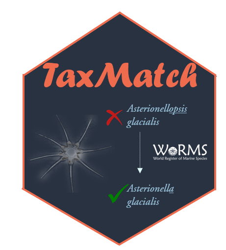

<!-- README.md is generated from README.Rmd. -->

#  Matching (phytoplankton) imagery categories to Worms accepted name

<!-- badges: start -->

 

<!-- badges: end -->

This repository contains a tutorial to match categories, especially categories from imagery, to accepted taxonomic names from WoRMS: <https://virginiesonnet.github.io/TaxonomyMatch/>

The Rmd version of the tutorial is available in the ***scripts*** folder.

The example csv file used as input is included in the ***data*** folder (*example_taxo.csv*) as well as the output file (*matched_example_taxo.csv*).
